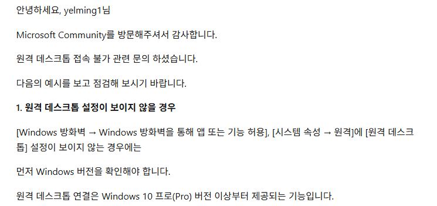
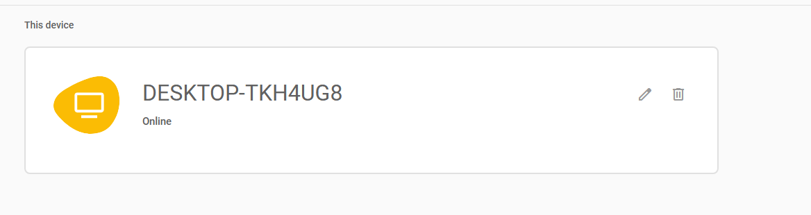
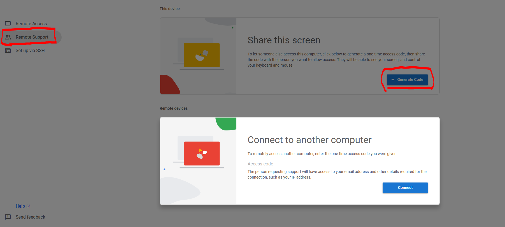
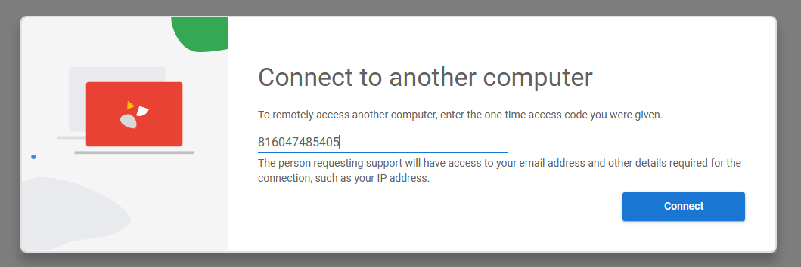
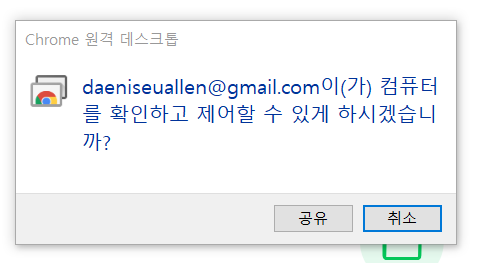
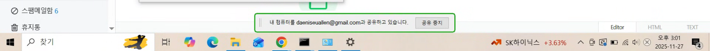

### 원격접속

datetime: 2025-11-27 13:12

<br>

>  의미

<br>

 간단히 말해서, 집 PC에서 회사 PC로 원격으로 붙어야된다고 생각하면 편하다.

<br>

>  필요성

<br>

- 현재 원격지 서버에서 `시스템 백업`, `파일 백업`  진행 상태 체크

- 몸이 아파서 회사에서  업무를 하지 못하는데 해야 될 때


<br>

> 원격 접속을 도와주는 도구

<br>

-  리눅스 , 유닉스와 같은  cli 기반 운영체제가 설치된 원격지에 접근을 도와주는
소프트웨어 `putty`

-  원격지에 설치된 윈도우 운영체제에 접근을 도와주는 `원격 데스크톱 연결`

-  원격서버기능을 제공하지 않는 윈도우즈 버전에서 이용가능한  `TeamViewer`


<br>


> <참고> 윈도우 HOME 버전으로 원격접속을 하고 싶다면 

윈도우 PRO를 이용하는 사용자가 HOME 버전으로 접속해야하는 일이 생길 것이다.
윈도우 HOME 버전은 원격접속기능을 제공하지 않는다. 왜냐하면 마이크로소프트 공식 오피셜이 있기 때문이다.

   

그러한 고난에 빠진 당신들을 위해  선물을 준비했다. 바로  크롬 브라우저를 만든 구글에서 제공하는  `chrome remote desktop` 이 있다. 아래에 소개대로 따라하면  몇분만에 원격
접속을 해보게 될것이다.

----

<br>

> chrome remote desktop 제품을 이용한 pc 원격 접속

<br>


 #1 
본인과 상대방의 디바이스에 chrome remote desktop 프로그램이 설치해야 하고, pc가 켜져있어야 한다.

```bash
## chrome remote desktop 프로그램 설치 경로: 
https://chromewebstore.google.com/detail/chrome-remote-desktop/inomeogfingihgjfjlpeplalcfajhgai?utm_source=ext_app_menu
```

#2
설치를 하고 나면  본인의 pc의 이름과 pin 번호를 등록하면 된다. 그러면 다음
디바이스가 생성된다. 




#3
등록이 끝났으면  왼쪽 두번째 메뉴에서 `service Support`를 클릭하고, `Generate Code`
를 클릭하면 키가 나오는데, 본인의 pc에 접근하려는 사용자에게 키를 전달한다. 



반대로 본인이 코드를 받았다면  Connect to another computer의  입력창에 코드를 입력한다.


#4
코드를 입력하고  Connect 버튼을 클릭한다.



#5 
원격지 PC에서 다음 PC에게 원격 PC 공유가능하게 할것이냐라는 prompt 창이 나옴니다.<br>



`공유`를 클릭합니다.

#6
  원격 pc에 접근 가능하게 된다. (참고로 원격PC는 접근시간이 존재하기에 해당 시간이 초과되면 코드를 재발급받아야된다. )




